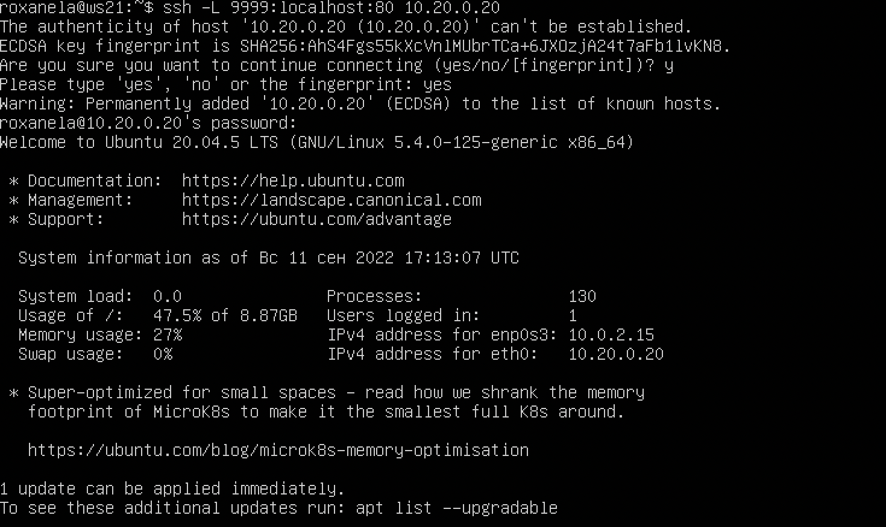

## Part 1. Инструмент ipcalc

### 1.1. Сети и маски

1) Адрес сети 192.167.38.54/13
**192.160.0.0**
2) Перевод маски 255.255.255.0 в префиксную и двоичную запись, /15 в обычную и двоичную, 11111111.11111111.11111111.11110000 в обычную и префиксную
Netmask:   255.255.255.0 = **24   11111111.11111111.11111111. 00000000**
Netmask:   **255.254.0.0** = 15     **11111111.1111111 0.00000000.00000000**
Netmask:   **255.255.255.240 = 28** 
3) Минимальный и максимальный хост в сети 12.167.38.4 при масках: /8, 11111111.11111111.00000000.00000000, 255.255.254.0 и /4
Netmask:   255.0.0.0 = **8**        
HostMin:   **12.0.0.1**             
HostMax:   **12.255.255.254**       
Netmask:   255.255.0.0 = 16     **11111111.11111111. 00000000.00000000**
HostMin:   **12.167.0.1**           00001100.10100111. 00000000.00000001
HostMax:   **12.167.255.254**       00001100.10100111. 11111111.11111110
Netmask:   **255.255.254.0** = 23   
HostMin:   **0.0.0.1**              
HostMax:   **0.0.1.254**            
Netmask:   240.0.0.0 = **4**        
HostMin:   **0.0.0.1**              
HostMax:   **15.255.255.254**

#### 1.2 localhost
 * Определить и записать в отчёт, можно ли обратиться к приложению, работающему на **localhost**, со следующими IP:  ̶1̶9̶4̶.̶3̶4̶.̶2̶3̶.̶1̶0̶0̶,̶  **127.0.0.2, 127.1.0.1,** ̶ ̶1̶2̶8̶.̶0̶.̶0̶.̶1̶

*Частные диапазоны IP-адресов 
Следующие диапазоны определены IANA как адреса, выделенные **локальным** сетям:
IPv4 
**10**.0.0.0 — 10.255.255.255 (маска подсети для бесклассовой (CIDR) адресации: 255.0.0.0 или /8)
**100.64**.0.0 **—** **100.127**.255.255 (маска подсети 255.192.0.0 или /10) — Данная подсеть рекомендована согласно RFC 6598 для использования в качестве адресов для CGN (Carrier-Grade NAT).
**172.16**.0.0 **—** **172.31**.255.255 (маска подсети: 255.240.0.0 или /12)
**192.168**.0.0 — 192.168.255.255 (маска подсети: 255.255.0.0 или /16)
Также для **петлевых** интерфейсов **(не используется для** обмена между узлами **сети)** зарезервирован диапазон **127**.0.0.0 — 127.255.255.255 (маска подсети: 255.0.0.0 или /8).*

#### 1.3. Диапазоны и сегменты сетей

1) из перечисленных IP можно использовать в качестве публичного: 134.43.0.2, 172.0.2.1, 172.68.0.2, 192.172.0.1, 192.169.168.1.
2) только в качестве частных: **10**.0.0.45, **192.168**.4.2, **172.20**.250.4, **172.16**.255.255, **10**.10.10.10.

3)  Все из перечисленных IP адресов шлюза возможны у сети 10.10.0.0/18: 10.0.0.1, 10.10.0.2, 10.10.10.10, 10.10.100.1, 10.10.1.255. Так как ни один из адресов не является адресом сети или широковещательным адресом.

        (ipcalc -b 10.0.0.1/18; ipcalc -b 10.10.0.2/18; ipcalc -b 10.10.10.10/18; ipcalc -b 10.10.100.1/18; ipcalc -b 10.10.1.255/18 ) | grep 'Address\|Network\|Broadcast'
  *
        Address:   10.0.0.1             
        Network:   10.0.0.0/18          
        Broadcast: 10.0.63.255          
        Address:   10.10.0.2            
        Network:   10.10.0.0/18         
        Broadcast: 10.10.63.255         
        Address:   10.10.10.10          
        Network:   10.10.0.0/18         
        Broadcast: 10.10.63.255         
        Address:   10.10.100.1          
        Network:   10.10.64.0/18        
        Broadcast: 10.10.127.255        
        Address:   10.10.1.255          
        Network:   10.10.0.0/18         
        Broadcast: 10.10.63.255 

## Part 2. Статическая маршрутизация между двумя машинами

- С помощью команды ip a посмотреть существующие сетевые интерфейсы

 Описать сетевой интерфейс, соответствующий внутренней сети, на обеих машинах и задать следующие адреса и маски: 
- - ws1 - 192.168.100.10, маска /16
- - ws2 - 172.24.116.8, маска /12
- - - В отчёт поместить скрины с содержанием изменённого файла etc/netplan/00-installer-config.yaml для каждой машины.

- Выполнить команду netplan apply для перезапуска сервиса сети

### 2.1. Добавление статического маршрута вручную

- Добавить статический маршрут от одной машины до другой и обратно при помощи команды вида ip r add

- Пропинговать соединение между машинами

### 2.2. Добавление статического маршрута с сохранением

- Перезапустить машины

- Добавить статический маршрут от одной машины до другой с помощью файла etc/netplan/00-installer-config.yaml

- Пропинговать соединение между машинами

## Утилита iperf3

### Скорость соединения

- Перевести и записать в отчёт: 
- - 8 Mbps - 1 MB/s
- - 100 MB/s - 800 000 Kbps
- - 1 Gbps в 1000 Mbps

### 3.2. Утилита iperf3

- Измерить скорость соединения между ws1 и ws2

## Part 4. Сетевой экран

### 4.1. Утилита iptables

- Создать файл /etc/firewall.sh, имитирующий фаерволл, на ws1 и ws2.

- Создать файл /etc/firewall.sh, имитирующий фаерволл, на ws1 и ws2:
  1) на ws1 применить стратегию когда в начале пишется запрещающее правило, а в конце пишется разрешающее правило (это касается пунктов 4 и 5)

  2) на ws2 применить стратегию когда в начале пишется разрешающее правило, а в конце пишется запрещающее правило (это касается пунктов 4 и 5)

  3) открыть на машинах доступ для порта 22 (ssh) и порта 80 (http)

  4) запретить echo reply (машина не должна "пинговаться”, т.е. должна быть блокировка на OUTPUT)

  5) разрешить echo reply (машина должна "пинговаться")

  

- Запустить файлы на обеих машинах командами chmod +x /etc/firewall.sh и /etc/firewall.sh

- Правила обрабатываются по очереди, поэтому ws2  на ping-request не отвечает.

### 4.2. Утилита nmap

- Командой ping найти машину, которая не "пингуется", после чего утилитой nmap показать, что хост машины запущен

## Part 5. Статическая маршрутизация сети

- Поднять пять виртуальных машин (3 рабочие станции (ws11, ws21, ws22) и 2 роутера (r1, r2))

### 5.1. Настройка адресов машин

- Настроить конфигурации машин в etc/netplan/00-installer-config.yaml согласно сети на рисунке.

- Перезапустить сервис сети. Если ошибок нет, то командой ip -4 a проверить, что адрес машины задан верно. Также пропинговать ws22 с ws21. Аналогично пропинговать r1 с ws11.

### 5.2. Включение переадресации IP-адресов.

- Для включения переадресации IP, выполните команду на роутерах:
- - sysctl -w net.ipv4.ip_forward=1
    При таком подходе переадресация не будет работать после перезагрузки системы.

 - Откройте файл /etc/sysctl.conf и добавьте в него следующую строку:
net.ipv4.ip_forward = 1
При использовании этого подхода, IP-переадресация включена на постоянной основе.

### 5.3. Установка маршрута по-умолчанию

- Настроить маршрут по-умолчанию (шлюз) для рабочих станций. Для этого добавить gateway4 [ip роутера] в файле конфигураций

- Вызвать ip r и показать, что добавился маршрут в таблицу маршрутизации

- Пропинговать с ws11 роутер r2 и показать на r2, что пинг доходит. Для этого использовать команду:
- - tcpdump -tn -i eth1

### 5.4. Добавление статических маршрутов

- Добавить в роутеры r1 и r2 статические маршруты в файле конфигураций.

- Вызвать ip r и показать таблицы с маршрутами на обоих роутерах.

 - Запустить команды на ws11:
- - ip r list 10.10.0.0/[маска сети] и ip r list 0.0.0.0/0

- - маршруты отличны, т.к. 10.10.0.0/18 это адрес текущей сети.

### 5.5. Построение списка маршрутизаторов

 - Запустить на r1 команду дампа:
 - - tcpdump -tnv -i eth0

 - При помощи утилиты traceroute построить список маршрутизаторов на пути от ws11 до ws21

 

  - Каждый пакет проходит на своем пути определенное количество узлов, пока достигнет своей цели. И, как мы уже знаем, каждый пакет имеет свое время жизни. Это количество узлов, которые может пройти пакет перед тем, как он будет уничтожен. Этот параметр записывается в заголовке TTL, каждый маршрутизатор, через который будет проходить пакет уменьшает его на единицу. При TTL=0 пакет уничтожается, а отправителю отсылается сообщение Time Exceeded.

    Команда traceroute linux использует UDP пакеты. Она отправляет пакет с TTL=1 и смотрит адрес ответившего узла, дальше TTL=2, TTL=3 и так пока не достигнет цели. Каждый раз отправляется по три пакета и для каждого из них измеряется время прохождения. Пакет отправляется на случайный порт, который, скорее всего, не занят.

### 5.6. Использование протокола ICMP при маршрутизации

- Запустить на r1 перехват сетевого трафика, проходящего через eth0 с помощью команды:
- - tcpdump -n -i eth0 icmp

- Пропинговать с ws11 несуществующий IP (например, 10.30.0.111) с помощью команды:
- - ping -c 1 10.30.0.111

## Part 6. Динамическая настройка IP с помощью DHCP

- Для r2 настроить в файле /etc/dhcp/dhcpd.conf конфигурацию службы DHCP:

1) указать адрес маршрутизатора по-умолчанию, DNS-сервер и адрес внутренней сети. Пример файла для r2:

2) в файле resolv.conf прописать nameserver 8.8.8.8.

- Перезагрузить службу DHCP командой systemctl restart isc-dhcp-server. Машину ws21 перезагрузить при помощи reboot и через ip a показать, что она 
получила адрес. Также пропинговать ws22 с ws21.

- Указать MAC адрес у ws11, для этого в etc/netplan/00-installer-config.yaml надо добавить строки: macaddress: 10:10:10:10:10:BA, dhcp4: true

- Для r1 настроить аналогично r2, но сделать выдачу адресов с жесткой привязкой к MAC-адресу (ws11). Провести аналогичные тесты

- Запросить с ws21 обновление ip адреса
- - до обновления

- - после обновления

## Part 7. NAT

- В файле /etc/apache2/ports.conf на ws22 и r1 изменить строку Listen 80 на Listen 0.0.0.0:80, то есть сделать сервер Apache2 общедоступным

- Запустить веб-сервер Apache командой service apache2 start на ws22 и r1

 - Добавить в фаервол, созданный по аналогии с фаерволом из Части 4, на r2 следующие правила:

1) Удаление правил в таблице filter - iptables -F

2) Удаление правил в таблице "NAT" - iptables -F -t nat

3) Отбрасывать все маршрутизируемые пакеты - iptables --policy FORWARD DROP

- Запускать файл также, как в Части 4

- Проверить соединение между ws22 и r1 командой ping

- Добавить в файл ещё одно правило:

4) Разрешить маршрутизацию всех пакетов протокола ICMP

 - Добавить в файл ещё два правила:

5) Включить SNAT, а именно маскирование всех локальных ip из локальной сети, находящейся за r2 (по обозначениям из Части 5 - сеть 10.20.0.0)
Совет: стоит подумать о маршрутизации внутренних пакетов, а также внешних пакетов с установленным соединением

6) Включить DNAT на 8080 порт машины r2 и добавить к веб-серверу Apache, запущенному на ws22, доступ извне сети

  

- Проверить соединение по TCP для SNAT, для этого с ws22 подключиться к серверу Apache на r1 командой:
telnet [адрес] [порт]
- Проверить соединение по TCP для DNAT, для этого с r1 подключиться к серверу Apache на ws22 командой telnet (обращаться по адресу r2 и порту 8080)

  ## Part 8. Дополнительно. Знакомство с SSH Tunnels

- Запустить на r2 фаервол с правилами из Части 7

- Запустить веб-сервер Apache на ws22 только на localhost (то есть в файле /etc/apache2/ports.conf изменить строку Listen 80 на Listen localhost:80)

- Воспользоваться Local TCP forwarding с ws21 до ws22, чтобы получить доступ к веб-серверу на ws22 с ws21

- Воспользоваться Remote TCP forwarding c ws11 до ws22, чтобы получить доступ к веб-серверу на ws22 с ws11

- Для проверки, сработало ли подключение в обоих предыдущих пунктах, перейдите во второй терминал (например, клавишами Alt + F2) и выполните команду:
telnet 127.0.0.1 [локальный порт]

